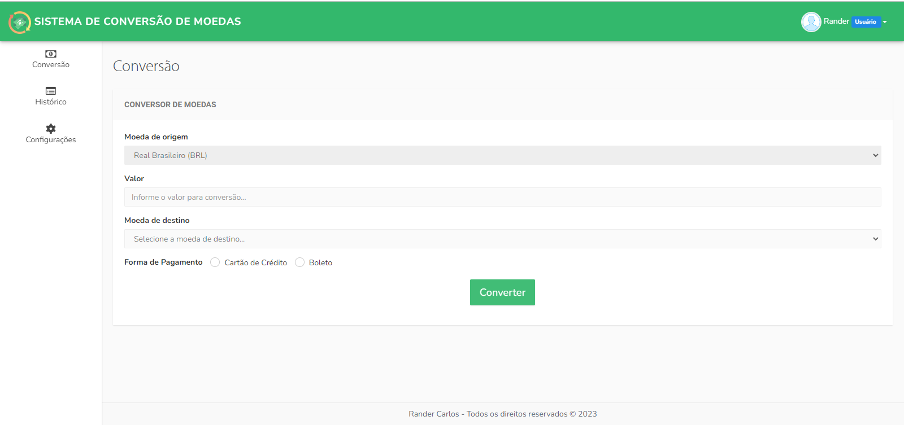

<h4 align="center">
  🚀 Sistema de Conversão de Moeda - Desafio técnico
</h4>



<p align="center">
    

  
</p>

<p align="center">
  <a href="#rocket-tecnologias">Tecnologias</a>&nbsp;&nbsp;&nbsp;|&nbsp;&nbsp;&nbsp;
  <a href="#-projeto">Projeto</a>&nbsp;&nbsp;&nbsp;|&nbsp;&nbsp;&nbsp;
  <a href="#-funcionalidades">Funcionalidades</a>&nbsp;&nbsp;&nbsp;|&nbsp;&nbsp;&nbsp;
  <a href="#-requisitos">Requisitos</a>&nbsp;&nbsp;&nbsp;|&nbsp;&nbsp;&nbsp;
  <a href="#-instalação">Instalação</a>&nbsp;&nbsp;&nbsp;|&nbsp;&nbsp;&nbsp;
</p>

<br>

## :rocket: Tecnologias

Esse projeto foi desenvolvido com as seguintes tecnologias:

- [PHP 8.2](https://php.net)
- [Laravel 10](https://laravel.com)
- [MySQL](https://mysql.com)
- [Docker](https://docker.com)


## 💻 Projeto

- Esse projeto é um sistema de câmbio de moedas para pagamento em boleto ou cartão de crédito desenvolvido como teste técnico para o processo seletivo de Desenvolvedor PHP Sênior na Oliveira Trust.

- O projeto está online e pode ser acessado no seguinte endereço: [https://oliveira-trust-6bca2b4d0dc7.herokuapp.com/](https://oliveira-trust-6bca2b4d0dc7.herokuapp.com) 


## 💻 Funcionalidades

O sistema possui as seguintes funcionalidades:

- O sistema possibilita câmbio do Real(moeda padrão) para as moedas mais negociadas mundialmente consumindo dados de uma API de cotação de moedas.
- Envia os dados do câmbio realizado por email.
- Grava no histórico os câmbios realizados.
- Permite configurar as taxas de conversão e da forma de pagamento.
- Possui sistema de autenticação completos com login, registro, verificação de email e reset de senha.
- Interface com uma boa usabilidade para melhorar a experiência do usuário.  

## 📄 Requisitos

* PHP 8.2+, Laravel 10+, MySQL 5.7 e Docker


## ⚙️ Instalação e execução

**Windows, OS X & Linux:**

Baixe o arquivo zip e o descompacte ou baixe o projeto para sua máquina através do git clone [https://github.com/randercarlos/oliveira-trust](https://github.com/randercarlos/oliveira-trust)


- Entre no prompt de comando e vá até a pasta do projeto:

```sh
cd ir-ate-a-pasta-do-projeto
```

- Crie o arquivo .env a partir do arquivo .env.example. As variáveis de ambiente relacionadas ao banco já estão configuradas.

```sh
copy .env.example .env
```

- Assumindo que tenha o docker instalado na máquina, para subir os containeres, execute o comando:

```sh
docker-compose up -d
```

- Após isso, execute o comando abaixo para instalar as dependências do laravel.

```sh
docker-compose exec currency-exchange-app composer install
``` 

- Depois de instalar as dependencias, crie as tabelas rodando o comando abaixo:

```sh
docker-compose exec currency-exchange-app php artisan migrate
``` 

- Após rodar o comando acima, será necessário configurar as variáveis de ambiente para envio de email.

  - Para simplificar o processo, foi utilizado **gmail** como servidor de email. Mas pode usar outro se quiser.
  - Para usar o gmail, será necessário configurar as seguintes variáveis de ambiente:

```sh
MAIL_USERNAME=
MAIL_PASSWORD=
MAIL_FROM_ADDRESS=
```

  - No **MAIL_USERNAME** e **MAIL_FROM_ADDRESS** será colocado o seu **endereço gmail**.
  - NO **MAIL_PASSWORD**, por motivos de segurança, o google não permite usar a sua senha do gmail.
  - Para isso, você vai ter que criar uma senha de app como explicado através desse link da ajuda do google: https://support.google.com/accounts/answer/185833?hl=pt-BR
  - Informe um nome pra senha e clique em gerar senha. Após gerar a senha, coloque-a na variável **MAIL_PASSWORD** e pronto. O envio de email está configurado.
  - Após isso, será necessário executar o comando que irá rodar as filas. Pra isso, execute o seguinte comando no terminal:

```sh
docker-compose exec currency-exchange-app php artisan queue:work
``` 

- Após rodar o comando acima, basta acessar o sistema no endereço [http://localhost:8000](http://localhost:8000).


## 📝 Documentação

- Para **acessar o sistema**, você pode:

  - Ou criar uma conta. Para isso, faça o seguinte:

      - Na tela de login, clique no link **"Criar uma conta"**. Após ter feito isso.
      - Na tela de **"Criar uma nova conta"**, preencha o nome, email, senha e confirmar senha. O email precisa existir, pois precisará ser verificado.
      - Clicar no botão **registrar**. Depois disso, uma email chegará na conta de email informado.
      - Acesse o email enviado e clique no botão que está no email. Você será levado para a tela do sistema e já estará logado nele.

  - Ou usar uma conta já criada. Para isso, na tela de login, informe os seguintes dados:
      - Email: teste@teste.com
      - Senha: teste
  
- Pronto. Basta usar o sistema.

Desenvolvido por Rander Carlos :wave: [Linkedin!](https://www.linkedin.com/in/rander-carlos-308a63a8//)
