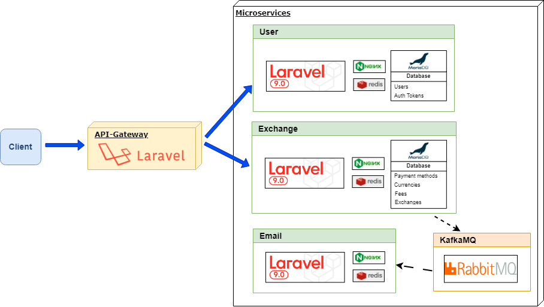
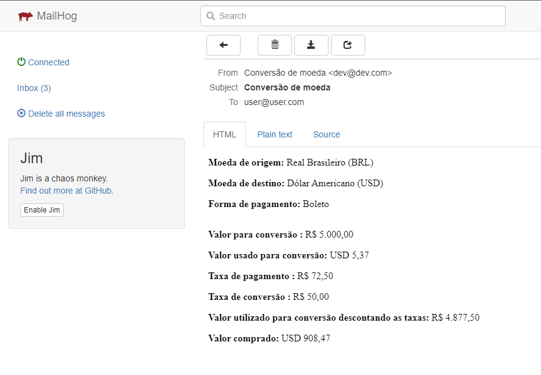

## Desafio para desenvolvedor backend na Oliveira Trust:
<p>
    
 </p>

Foi solicitado o desenvolvimento de uma aplicação que faça a conversão da nossa moeda nacional para uma moeda estrangeira, aplicando algumas taxas e regras, no final da conversão o resultado deverá ficar em tela de forma detalhada.


# Backend

---


Foram utilizados conceitos simples de microserviços modularizando o backend em 4 partes.

Em todos os ``microserviços`` foram utilizados ``Laravel 9`` e ``Docker`` em seu desenvolvimento.

- ``Api-gateway``
- ``Email``
- ``Exchange``
- ``User``

 O projeto tambem conta com um serviço de ``RabbitMQ`` para comunicação com o microserviço de ``Emails``.


 


## Tecnologias utilizadas.

- PHP 8.1
- Laravel 9
- RabbitMQ
- MailHog
- Redis
- MariaDB
- Docker
- Composer
- Nginx


## Responsabilidades

#### Api-gateway

- Servir como porta de entrada das requisições WEB-API e encaminhar cada uma delas para seu respectivo ``microserviço``.

#### User

- Autenticar e armazenar dados de usuários.

#### Exchange

- Processar e armazenar as cotações de conversão de moeda e taxas.

#### Email

- Receber solicitações de disparo de emails atraves de eventos ``RabbitMQ``.
- Processar disparos de emails em fila utilizando ``REDIS`` ou ``RabbitMQ`` .


## Instruções de uso

---

Para o funcionamento desse projeto precisaremos do `Docker` instalado.
- https://www.docker.com/

### Portas utilizadas
- 8080 (Nginx Api-Gateway)
- 5672 e 15672 (RabbitMQ)
- 8003 e 8100 (MailHog)

Devemos subir os microserviços um de cada vez.

Execute os seguintes comandos um por vez e aguarde até que sejam concluídos.

### RabbitMQ Service

```
docker-compose -f ./backend/rabbitmq/docker-compose.yml up -d
```

- O painel do `RabbitMq` controle pode ser acessado na url http://localhost:15672
- user: `admin`
- password: `admin`


### Email Service

```
docker-compose -f ./backend/email/docker-compose.yml up -d
docker-compose -f ./backend/email/docker-compose.yml exec app cp .env.example .env -r
docker-compose -f ./backend/email/docker-compose.yml exec app composer install
docker-compose -f ./backend/email/docker-compose.yml exec app php artisan key:generate
docker-compose -f ./backend/email/docker-compose.yml exec app php artisan migrate:fresh
```

- O painel de acesso ao MailHog pode ser acessado na url http://localhost:8100'. Com ele será possível monitorar os emails disparados durante o desenvolvimento.



### User Service

```
docker-compose -f ./backend/user/docker-compose.yml up -d
docker-compose -f ./backend/user/docker-compose.yml exec app cp .env.example .env -r
docker-compose -f ./backend/user/docker-compose.yml exec app composer install
docker-compose -f ./backend/user/docker-compose.yml exec app php artisan key:generate
docker-compose -f ./backend/user/docker-compose.yml exec app php artisan migrate:fresh --seed
```

### Exchange Service

```
docker-compose -f ./backend/exchange/docker-compose.yml up -d
docker-compose -f ./backend/exchange/docker-compose.yml exec app cp .env.example .env -r
docker-compose -f ./backend/exchange/docker-compose.yml exec app composer install
docker-compose -f ./backend/exchange/docker-compose.yml exec app php artisan key:generate
docker-compose -f ./backend/exchange/docker-compose.yml exec app php artisan migrate:fresh --seed
```

### API Gateway Service

```
docker-compose -f ./backend/api-gateway/docker-compose.yml up -d
docker-compose -f ./backend/api-gateway/docker-compose.yml exec app cp .env.example .env -r
docker-compose -f ./backend/api-gateway/docker-compose.yml exec app composer install
docker-compose -f ./backend/api-gateway/docker-compose.yml exec app php artisan key:generate
```

Apos o serviço de  `API Gateway` estiver online, será possível acessar ele pela url http://localhost:8080/api

