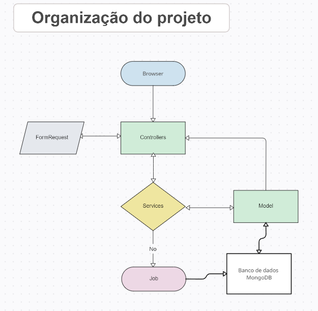

# Título do projeto

Teste para Desenvolvedor Backend

## ⚙️ Um pouco sobre a organização do Teste

O projeto esta divido em camadas. 

Controllers, Validações com FormRequest, Services, Models, Job e Por ultimo a base de dados princimpal com mongoDB.



## 🚀 Começando

Essas instruções permitirão que você obtenha uma cópia do teste feito por mim.

### 📋 Pré-requisitos

O que vai precisar para instalá-lo?

Docker, Mysql, MongoDB, Redis e Laravel

Esse teste ultiliza docker, então todos os serviços estão no docker-compose.

```
https://www.docker.com/
```

### 🔧 Instalação

Uma série de exemplos passo-a-passo que informam o que você deve executar para ter um ambiente de desenvolvimento para a execução do teste.

Baixar o Docker.

```
Link para dowload: https://www.docker.com/
```
Clonar o repositorio do github

```
https://github.com/guilherf13/desafio-desenvolvedor.git
```
Entre dentro da pasta backend

```
cd backend
```
Execute o comando para subir os containers do docker.

```
docker compose up -d
```
Crie o arquivo.env

```
cp .env.example .env
```
Subistitua essa configuração pela que esta no seu .env

```
DB_CONNECTION=mongodb
DB_HOST=mongo
DB_PORT=27017
DB_DATABASE=laravel
DB_USERNAME=root
DB_PASSWORD=1234Senha

DB_CONNECTION2=mysql
DB_HOST2=mysql
DB_PORT2=3306
DB_DATABASE2=laravel_auth
DB_USERNAME2=auth_user
DB_PASSWORD2=auth_password

SESSION_DRIVER=database
SESSION_LIFETIME=120
SESSION_ENCRYPT=false
SESSION_PATH=/
SESSION_DOMAIN=null

BROADCAST_CONNECTION=log
FILESYSTEM_DISK=local
QUEUE_CONNECTION=redis

CACHE_STORE=redis
CACHE_PREFIX=

MEMCACHED_HOST=127.0.0.1

REDIS_CLIENT=phpredis
REDIS_HOST=redis
REDIS_PASSWORD=null
REDIS_PORT=6379
```

Acesse o container backend

```
docker compose exec backend bash
```

Instale as dependencia do projeto
```
composer install
```

Gere a key do projeto Laravel
```
php artisan key:generate
```

Rodar as migrations

```
php artisan migrate
```

Rodando o seed de usuario teste
```
php artisan db:seed
```
### OBS: A Documentação para os endpoints, estão no arquivo Documentation.md, na raiz do projeto. 

O endpoint (post) api/v1/upload, requer o servidor de job rodando durante a execução.

para testar o endpoint antes execute o seguinte comando.

```
php artisan queue:work
```
Termine com um exemplo de como obter dados do sistema ou como usá-los para uma pequena demonstração.

## 🛠️ Construído com

* [Docker](https://www.docker.com/) - Gerenciador de serviços via containers
* [Mysql](https://www.mysql.com/) - Banco de dados para autenticação das apis
* [MongoDB](https://rometools.github.io/rome/) - Banco de dados principal 
* [Redis](https://rometools.github.io/rome/) - Usado para cache
* [Laravel](https://rometools.github.io/rome/) - Framework para web